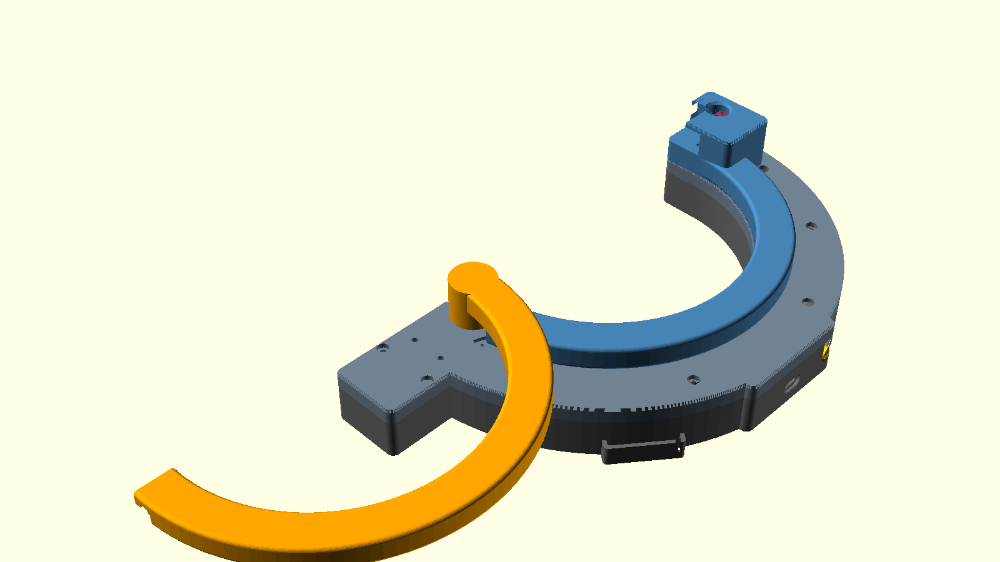
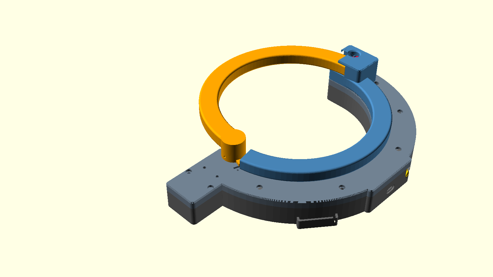
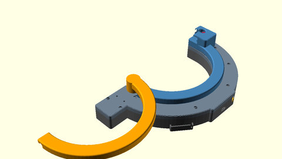
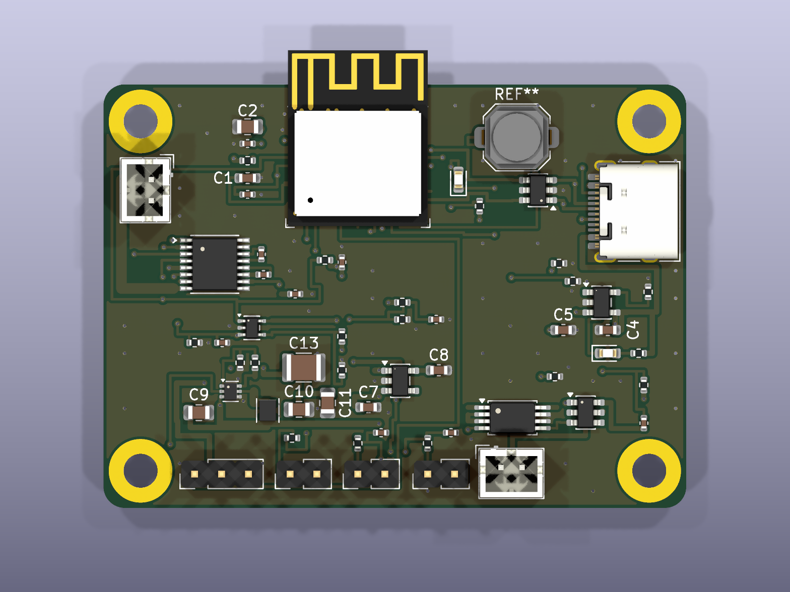
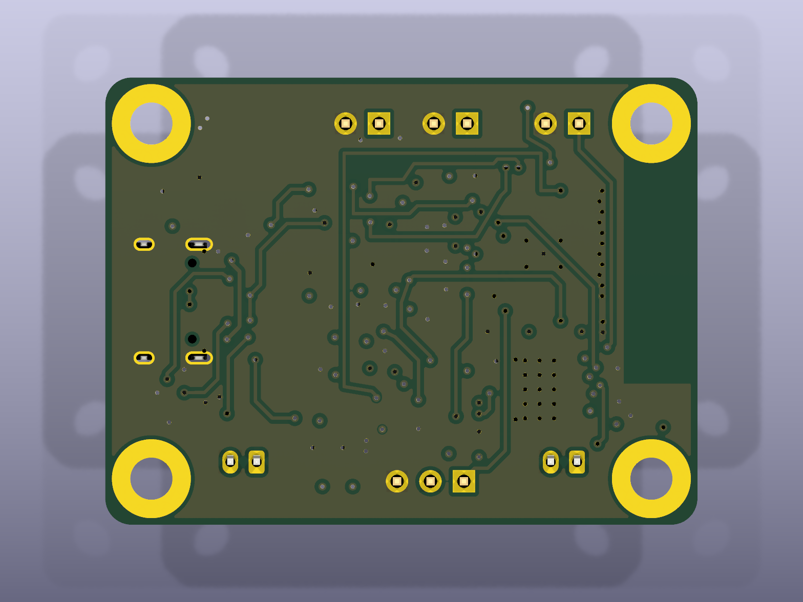
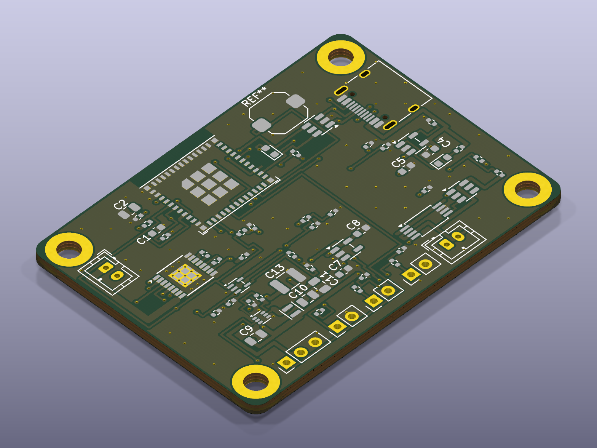

# Folding-Arc Bike Lock

A self-closing bike lock built as a clamshell ring. A fixed arc bolts to the housing, a hinged arc swings 180 degrees to meet it, and a worm gearmotor closes the loop around the frame and rim on a button press or a BLE command. A spring latch pin seats with power off, a keyed cam lock covers a dead battery, and an ESP32-C3 on a 4-layer PCB runs the state machine.

<table>
<tr>
<td></td>
<td></td>
</tr>
</table>



The animation shows one closing cycle: the swing arc starts folded open, sweeps around to the receiver, and the latch pin seats.

<table>
<tr>
<td></td>
<td></td>
<td></td>
</tr>
</table>

Read `docs/design.md` for the mechanism, the torque analysis, and the electronics.

## Repository layout

- `hw/` holds the KiCad schematic, the board, the design rules, and the stack manifest.
- `lib/` holds the symbols, the footprints, and the 3D models.
- `firmware/` holds the PlatformIO project for the ESP32-C3.
- `3d/` holds the OpenSCAD housing, the board render script, and the renders.
- `scripts/` holds the release script and the validation scripts.
- `fab/` holds the fabrication data, written by `scripts/release.sh`.

## Build

```
pio run -d firmware
openscad -o temp/arc_swing.stl -D 'part="arc_swing"' 3d/housing.scad
python3 3d/build.py
scripts/release.sh hw/triangle_flywheel_balancer.kicad_pcb
```

The first command builds the firmware, the second renders one housing part (`housing_inner`, `housing_lid`, `arc_fixed`, `arc_swing`, `latch_pin`, `assembly`), the third writes the board renders and the viewer page, and the fourth writes the fabrication tree.
